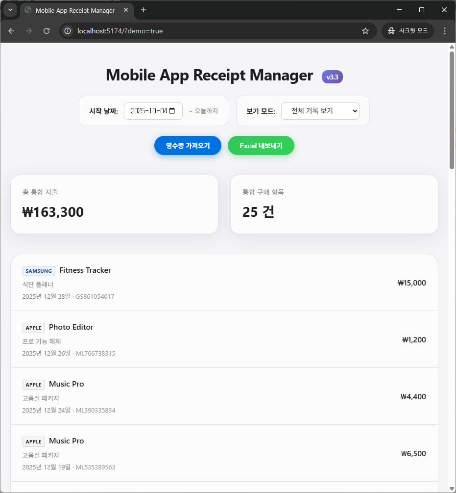
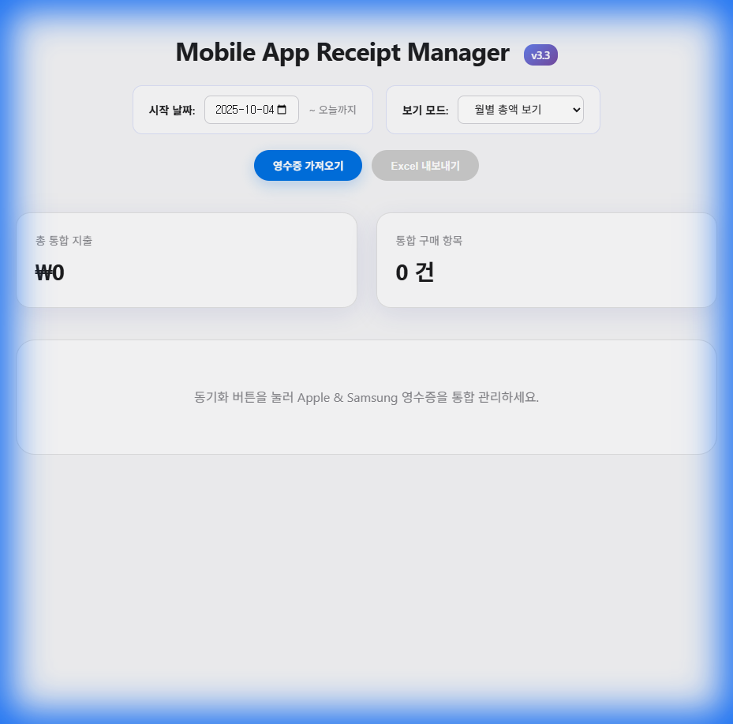

# 📱 Mobile App Receipt Manager

Apple App Store와 Samsung Galaxy Store 영수증을 통합 관리하는 웹 애플리케이션입니다.


## 📸 스크린샷

| 전체 내역 모드 | 월별 요약 모드 |
|:---:|:---:|
|  |  |

## ✨ 주요 기능

- **🔄 통합 동기화**: iCloud(Apple)와 Gmail(Samsung) 이메일에서 영수증 자동 수집
- **🏷️ 브랜드 자동 인식**: Apple과 Samsung 영수증을 자동으로 구분하여 파싱
- **📅 날짜 필터링**: 원하는 기간의 영수증만 선택적으로 조회
- **📊 지출 분석**: 월별 바 차트 + 드릴다운 상세 보기
- **📥 Excel 내보내기**: 월별 요약 + 전체 내역 두 시트로 구성된 XLSX 파일

## 🛠️ 기술 스택

| 구분 | 기술 |
|------|------|
| **Frontend** | React, Vite |
| **Backend** | Node.js, Express |
| **Email** | IMAP (imapflow) |
| **Parsing** | Cheerio, quoted-printable |
| **Export** | ExcelJS (XLSX) |
| **Deployment** | Vercel Serverless Functions |

## ⚡ 빠른 시작

### 1. 프로젝트 클론

```bash
git clone https://github.com/winterrainlee/apple-receipt-app.git
cd apple-receipt-app
npm install
```

### 2. 환경 변수 설정

`.env` 파일을 생성하고 다음 내용을 입력하세요:

```env
# iCloud (Apple 영수증용)
ICLOUD_EMAIL=your-apple-id@icloud.com
ICLOUD_PASSWORD=your-app-specific-password

# Gmail (Samsung 영수증용)
GMAIL_EMAIL=your-email@gmail.com
GMAIL_PASSWORD=your-16-digit-app-password

# Server
PORT=5000
```

> ⚠️ **중요**: 일반 비밀번호가 아닌 **앱 전용 비밀번호**를 사용해야 합니다!

### 3. 앱 전용 비밀번호 발급

#### Apple (iCloud)
1. [Apple ID 관리](https://appleid.apple.com) 접속
2. 로그인 및 보안 → 앱 비밀번호 → 비밀번호 생성

#### Google (Gmail)
1. [Google 계정 관리](https://myaccount.google.com) 접속
2. 보안 → 2단계 인증 활성화 → 앱 비밀번호 생성

### 4. 실행

```bash
# 백엔드 서버 시작
npm run server

# 프론트엔드 개발 서버 시작 (새 터미널에서)
npm run dev
```

브라우저에서 `http://localhost:5173` 접속

## 🚀 Vercel 배포

### 1. GitHub 연결
- Vercel 대시보드에서 GitHub 저장소 Import

### 2. 환경 변수 설정
**Project Settings → Environment Variables**에서 추가:
- `ICLOUD_EMAIL`
- `ICLOUD_PASSWORD`
- `GMAIL_EMAIL`
- `GMAIL_PASSWORD`

### 3. 배포
Push 시 자동 배포됩니다.

## 📁 프로젝트 구조

```
├── api/
│   └── index.js          # Vercel Serverless 진입점
├── server/
│   ├── index.js          # Express 서버
│   ├── imap-client.js    # IMAP 연결 및 이메일 수집
│   └── receipt-parser.js # 영수증 HTML 파싱
├── src/
│   ├── App.jsx           # React 메인 컴포넌트
│   ├── index.css         # 스타일시트
│   └── main.jsx          # React 진입점
├── index.html
├── vite.config.js
├── vercel.json
└── package.json
```

## 📋 지원 영수증 형식

| 플랫폼 | 발신자 | 추출 정보 |
|--------|--------|-----------|
| Apple | `no_reply@email.apple.com` | 앱 이름, 상품명, 주문 ID, 금액 |
| Samsung | `applicationstore@samsung.com` | 앱 이름, 상품명, 주문 번호, 합계 |

## 🔧 설정 옵션

### 날짜 범위
기본값은 3개월 전부터 오늘까지입니다. UI에서 시작 날짜를 변경할 수 있습니다.

### Excel 내보내기
내보내기 XLSX 파일에는 두 개의 시트가 포함됩니다:

**월별 요약 시트:**
- 연도, 월, 총 금액, 구매 건수

**전체 내역 시트:**
- 날짜, 플랫폼 (Apple/Samsung)
- 주문번호, 앱이름, 상품명
- 금액, 금액(숫자)

## 🐛 문제 해결

### 동기화가 안 됩니다
1. 앱 비밀번호가 올바른지 확인
2. iCloud/Gmail IMAP이 활성화되어 있는지 확인
3. 서버 콘솔에서 에러 메시지 확인

### Vercel에서 작동하지 않습니다
1. 환경변수가 **프로젝트 설정**에 추가되어 있는지 확인 (전역 설정 ❌)
2. 환경변수 추가 후 **Redeploy** 실행

## 📄 라이선스

MIT License

## 👨‍💻 개발자

[@winterrainlee](https://github.com/winterrainlee)
