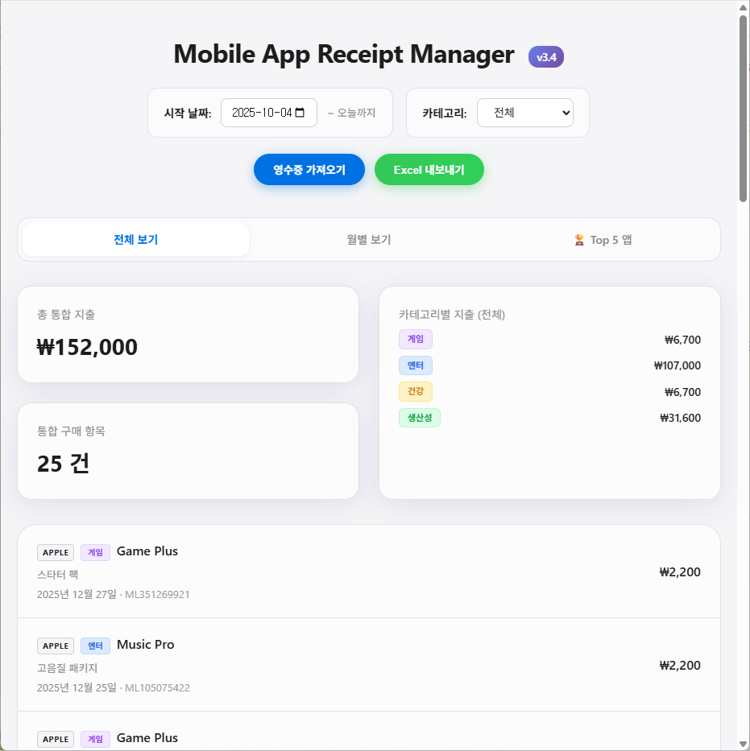
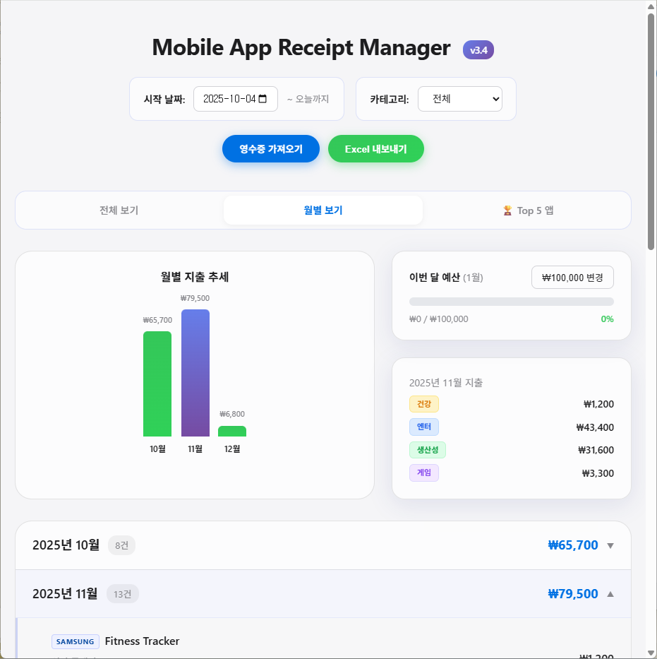

# Mobile App Receipt Manager v3.5

**Apple App Store**와 **Samsung Galaxy Store**의 앱 구독 및 인앱 결제 내역을 통합 관리하는 스마트 대시보드입니다.



## 🚀 주요 기능

### 📊 스마트 대시보드
- **탭 기반 탐색**: [전체 보기], [월별 보기], [Top 5 앱] 탭을 통해 직관적으로 화면을 전환할 수 있습니다.
- **Top 5 앱 분석**: 가장 많이 지출한 상위 5개 앱을 선정하여 보여줍니다.
- **상세 보기 (Drill-down)**: Top 5 앱을 클릭하면 해당 앱의 월별 지출 추이를 막대 그래프로 상세하게 확인할 수 있습니다.
- **월별 총액 보기**: 월별 지출 추세와 예산 달성률을 한눈에 파악할 수 있습니다.

### 🧠 스마트 카테고리 감지 (Smart Category Detection)
- **iTunes API 연동**: 앱 이름(예: Minecraft, KakaoTalk)을 기반으로 정확한 카테고리(게임, 엔터 등)를 자동으로 찾아냅니다.
- **하이브리드 시스템**: API 검색 실패 시, 내장된 키워드 분석 로직이 백업으로 작동합니다.
- **글로벌 필터링**: 통계 카드의 카테고리를 클릭하면, 차트와 리스트를 포함한 대시보드의 모든 데이터가 해당 카테고리 기준으로 필터링됩니다.

### 💰 예산 관리 (Budget Management)
- **월간 예산 설정**: 목표 지출 금액을 설정하고 관리할 수 있습니다.
- **시각적 진행률**: 지출 흐름에 따라 진행 바의 색상이 변경됩니다 (80% 이상 주황색, 100% 초과 빨간색).
- **직관적인 헤더**: "이번 달 예산 (1월)"과 같이 현재 월을 명확하게 표시합니다.

---

## 👶 초보자를 위한 설치 및 실행 가이드

> **💡 팁: 그래도 너무 어렵다면?**
>
> 이 가이드 내용을 복사해서 **ChatGPT**, **Gemini**, **Claude** 같은 AI에게 물어보세요!
> "이 가이드를 보고 설치하려고 하는데, 3단계에서 막혔어. 도와줘!" 라고 하면 친절하게 알려줍니다.

Git이나 코딩을 잘 모르셔도 괜찮습니다! 아래 순서대로 따라 하시면 내 컴퓨터에서 바로 실행할 수 있습니다.

### 1단계: Node.js 설치
이 프로그램을 실행하려면 'Node.js'라는 도구가 필요합니다.
1. [Node.js 공식 홈페이지](https://nodejs.org/)에 접속합니다.
2. **LTS 버전** (안정적인 버전)을 다운로드하고 설치합니다.
3. 설치가 끝나면 컴퓨터를 한번 재부팅 해주세요.

### 2단계: 소스 코드 다운로드
1. 지금 보고 계신 페이지 우측 상단의 초록색 **Code** 버튼을 누릅니다.
2. **Download ZIP**을 클릭하여 압축 파일을 받습니다.
3. 압축을 원하는 폴더에 풉니다. (예: 바탕화면)
4. 압축 푼 폴더 안으로 들어갑니다. (`package.json` 파일이 보이는 곳이어야 합니다)

### 3단계: 환경설정 (필수!) ⭐
이 프로그램은 우리의 이메일에 접속해서 영수증을 읽어옵니다. 보안을 위해 이메일 비밀번호 대신 **'앱 비밀번호'** 를 사용해야 합니다.

1. **앱 비밀번호 발급받기**
   - **Apple (iCloud)**:
     1. [Apple ID](https://appleid.apple.com) 접속 및 로그인
     2. **로그인 및 보안** -> **앱 암호**
     3. 암호 생성 (이름은 `receipt-app` 등 자유롭게) 및 복사해두기
   - **Google (Gmail - 삼성결제용)**:
     1. [Google 계정](https://myaccount.google.com/security) -> **보안**
     2. **2단계 인증** (꺼져있다면 켜야 합니다)
     3. 2단계 인증 페이지 맨 아래 **'앱 비밀번호'**
     4. 앱 이름 입력 후 생성 -> 16자리 비밀번호 복사해두기

2. **설정 파일 만들기**
   - 다운로드한 폴더 안에 `.env.example` 파일이 있습니다.
   - 이 파일의 이름을 `.env` 로 바꿉니다. (이름 바꾸기 -> `.example` 지우기)
   - 메모장으로 엽니다.
   - 아까 복사한 아이디와 **앱 비밀번호**를 `=` 뒤에 붙여넣고 저장합니다.

> **⛔ 보안 경고: `.env` 파일은 절대 공유 금지!**
> 이 파일에는 여러분의 이메일 비밀번호가 들어있습니다.
> - **절대 GitHub에 올리지 마세요.** (이미 `.gitignore`에 등록되어 있지만 조심해야 합니다)
> - 만약 실수로 올렸다면, 즉시 **GitHub 저장소를 삭제**하고 **앱 비밀번호를 폐기(삭제)** 후 새로 발급받으세요.

3. **앱 비밀번호 관리 및 폐기 (사용이 끝났다면)**
   - 이 프로그램을 더 이상 사용하지 않거나 비밀번호가 노출된 경우, 발급받았던 앱 비밀번호를 반드시 삭제해야 합니다.
   - **Apple/Google 계정 설정 페이지**로 돌아가서 해당 앱 비밀번호 옆의 **'삭제(휴지통)'** 버튼을 누르면 즉시 무효화됩니다. 안전을 위해 사용하지 않는 비밀번호는 남겨두지 마세요.

### 4단계: 프로그램 실행하기
**방금 압축을 푼 폴더 안에서** (파일 목록에 `package.json`이 보이는 곳에서) 시작합니다.

1. **터미널 열기**:
   - 폴더 빈 공간에 마우스를 대고 **`Shift` + `우클릭`** 을 합니다.
   - **"PowerShell 창 여기서 열기"** (또는 "터미널에서 열기")를 클릭합니다.
   
2. **명령어 입력**:
   새로 뜬 파란색(또는 검은색) 창에 아래 명령어를 입력하고 엔터를 치세요.

```bash
npm install   # 처음 한 번만 하면 됩니다
npm start
```

그러면 **"서버"**와 **"화면"**이 동시에 켜지고, 인터넷 창이 자동으로 열립니다!
(주소: http://localhost:5173)

> **⚠️ 윈도우 PowerShell 오류 해결**
> 만약 빨간색 글씨로 **'보안 오류'** 나 **'PSSecurityException'** 이 뜬다면,
> `npm start` 대신 아래 명령어를 입력하세요:
> ```bash
> npm.cmd start
> ```

### 5단계: 접속하기
자동으로 인터넷 창이 열리거나, 열리지 않으면 주소창에 아래 주소를 입력하세요.
👉 **http://localhost:5173**

### 6단계: 프로그램 종료하기 (중요!)
프로그램을 끄려면 터미널 창에서 **`Ctrl` + `C`** 를 누르거나, 아래 명령어를 실행하세요.
Windows에서는 단순히 창을 닫아도 백그라운드에서 계속 실행될 수 있으니 **꼭 이 명령어로 종료하는 것을 권장합니다.**

```bash
npm run stop
```
(Windows PowerShell에서 오류 발생 시: `npm.cmd run stop`)

### 7단계: 웹사이트로 배포하기 (Vercel)
> **⚠️ 보안 주의사항 & 체크리스트**:
> Vercel 배포는 스마트폰 접속이 가능해 편리하지만, 다음 사항을 반드시 고려해야 합니다.
> 1. **비밀값 서버 전용 원칙**: 앱 비밀번호 같은 중요 정보는 절대 브라우저(클라이언트) 코드에 포함되면 안 됩니다. Vercel 환경 변수로 설정하더라도, 배포된 서버에 이 값이 저장된다는 점을 인지해야 합니다.
> 2. **사용 후 폐기**: 배포 테스트가 끝나면 Vercel 프로젝트를 삭제하거나, 사용한 앱 비밀번호를 폐기하는 것이 가장 안전합니다.
> 3. **개인 용도**: 이 프로젝트는 개인적인 용도로만 사용해야 하며, 공용 네트워크나 타인에게 URL을 공유하지 마세요.
>
> **보안상 가장 추천하는 방법은 로컬 실행(내 컴퓨터에서 실행)입니다.**

내 컴퓨터뿐만 아니라 스마트폰에서도 접속하고 싶다면 **Vercel**을 이용해 무료로 배포할 수 있습니다.

1. **터미널 입력**:
   아래 명령어를 입력하여 Vercel 도구를 실행합니다.
   ```bash
   npx vercel
   ```

2. **로그인 및 설정**:
   - `Log in to Vercel`이 뜨면 `Continue with GitHub` 등을 선택해 로그인합니다. (계정이 없다면 가입해 주세요)
   - `Set up and deploy? [Y/n]`: **y** 입력 엔터
   - `Which scope do you want to deploy to?`: 그냥 **엔터**
   - `Link to existing project? [y/N]`: **n** 입력 엔터
   - `What’s your project’s name?`: 원하는 이름 입력하고 **엔터**
   - `In which directory is your code located?`: 그냥 **엔터**
   - **(중요)** `Want to modify these settings?`: **y** 입력 엔터 (환경 변수를 설정해야 합니다!)

3. **환경 변수 추가**:
   - `ICLOUD_EMAIL`: Apple ID 이메일
   - `ICLOUD_PASSWORD`: 아까 발급받은 Apple 앱 암호
   - `GMAIL_EMAIL`: Gmail 이메일 (삼성 결제 내역이 있는 경우)
   - `GMAIL_PASSWORD`: 아까 발급받은 Google 앱 비밀번호
   - *팁: 터미널 입력이 어렵다면, 일단 'n'으로 넘기고 나중에 Vercel 웹사이트(Settings > Environment Variables)에서 추가해도 됩니다.*

4. **완료!**:
   잠시 기다리면 `Production: https://your-project-name.vercel.app` 주소가 나옵니다.
   이제 이 주소로 어디서든 접속할 수 있습니다! 🎉

---

## 🛠️ 기술 스택 (Tech Stack)
- **Frontend**: React, Vite, Chart.js
- **Backend**: Node.js, Express
- **API**: Apple iTunes Search API (무료/공개 API 사용)

## 📸 스크린샷 (Screenshots)

| 전체 보기 (All View) | 월별 보기 (Monthly View) |
|----------------------|--------------------------|
|  |  |

| Top 5 앱 (Top 5 Apps) |
|-----------------------|
|  |

## 📝 라이선스 (License)

이 프로젝트는 **MIT License**에 따라 자유롭게 사용, 수정, 배포할 수 있습니다.
자세한 내용은 [LICENSE](LICENSE) 파일을 참고하세요.
