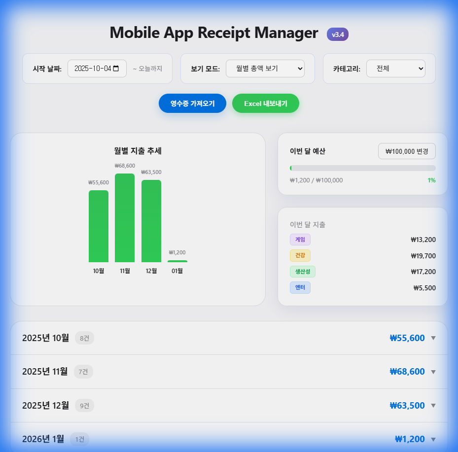
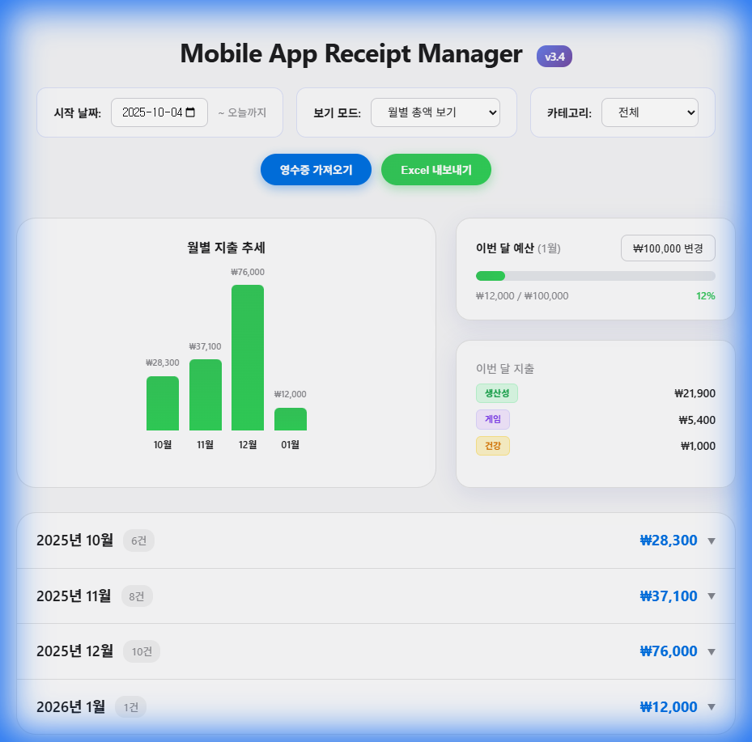

# Mobile App Receipt Manager v3.4

**Apple App Store**와 **Samsung Galaxy Store**� 앱 구� � �앱 결제 내역� 통합 관리하는 스마트 대시보드�니다.



## 🚀 주요 기능

### 📊 스마트 대시보드
- **전체 기� 보기 (Detail View)**: � 지출액, 구매 건수, 전체 기간� 카테고리별 지출 분�를 한눈� 파악할 수 �습니다.
- **월별 �액 보기 (Monthly View)**: 월별 지출 추세, 예산 달성률, 월별 카테고리 통계� 집중할 수 �습니다.
- **분할 레�아웃 (Split Layout)**: 정보 밀�를 높� 최�화� 2열 그리드 디��� 제공합니다.

### 🧠 스마트 카테고리 �지 (Smart Category Detection)
- **iTunes API 연�**: 앱 �름(예: Minecraft, KakaoTalk)� 기반으로 정확한 카테고리(게�, 엔터 등)를 ��으로 찾아냅니다.
- **하�브리드 시스템**: API 검색 실패 시, 내�� 키워드 분� 로�� 백업으로 ��합니다.
- **글로벌 필터�**: 통계 카드� 카테고리를 �릭하면, 차트와 리스트를 �함한 대시보드� 모든 ��터가 해당 카테고리 기준으로 필터��니다.

### 💰 예산 관리 (Budget Management)
- **월간 예산 설정**: 목표 지출 금액� 설정하고 관리할 수 �습니다.
- **시�� 진행률**: 지출 �름� 따� 진행 바� 색�� 변경�니다 (80% �� 주황색, 100% 초과 빨간색).
- **�관�� 헤�**: "�번 달 예산 (1월)"과 같� 현� 월� 명확하게 표시합니다.

---

## 👶 초보�를 위한 설치 � 실행 가�드

> **💡 �: 그�� 너무 어렵다면?**
>
> � 가�드 내용� 복사해서 **ChatGPT**, **Gemini**, **Claude** 같� AI�게 물어보세요!
> "� 가�드를 보고 설치하려고 하는�, 3단계�서 막혔어. �와줘!" �고 하면 친절하게 알려�니다.

Git�나 코딩� � 모르셔� 괜찮습니다! 아� 순서대로 따� 하시면 내 컴퓨터�서 바로 실행할 수 �습니다.

### 1단계: Node.js 설치
� 프로그�� 실행하려면 'Node.js'�는 �구가 필요합니다.
1. [Node.js 공� 홈��지](https://nodejs.org/)� 접�합니다.
2. **LTS 버전** (안정�� 버전)� 다운로드하고 설치합니다.
3. 설치가 �나면 컴퓨터를 한번 �부팅 해주세요.

### 2단계: 소스 코드 다운로드
1. 지금 보고 계신 ��지 우측 �단� 초�색 **Code** 버튼� 누릅니다.
2. **Download ZIP**� �릭하여 압축 파�� 받습니다.
3. 압축� �하는 ��� 풉니다. (예: 바탕화면)
4. 압축 푼 �� 안으로 들어갑니다. (`package.json` 파�� 보�는 곳�어야 합니다)

### 3단계: 환경설정 (필수!) �
� 프로그�� 우리� �메�� 접�해서 �수�� �어옵니다. 보안� 위해 �메� 비밀번호 대신 **'앱 비밀번호'**를 사용해야 합니다.

1. **앱 비밀번호 발급받기**
   - **Apple (iCloud)**:
     1. [Apple ID](https://appleid.apple.com) 접� � 로그�
     2. **로그� � 보안** -> **앱 암호**
     3. 암호 �성 (�름� `receipt-app` 등 �유롭게) � 복사해�기
   - **Google (Gmail - 삼성결제용)**:
     1. [Google 계정](https://myaccount.google.com/security) -> **보안**
     2. **2단계 ��** (꺼져�다면 켜야 합니다)
     3. 2단계 �� ��지 맨 아� **'앱 비밀번호'**
     4. 앱 �름 �력 후 �성 -> 16�리 비밀번호 복사해�기

2. **설정 파� 만들기**
   - 다운로드한 �� 안� `.env.example` 파�� �습니다.
   - � 파�� �름� `.env` 로 바꿉니다. (�름 바꾸기 -> `.example` 지우기)
   - 메모�으로 엽니다.
   - 아까 복사한 아�디와 **앱 비밀번호**를 `=` 뒤� 붙여넣고 저�합니다.

### 4단계: 터미�(실행 창) 열기
명령어를 �력할 창� **2개** 필요합니다.
1. �� 빈 공간�서 `Shift` 키를 누른 채로 **마우스 오른쪽 버튼**� �릭합니다.
2. **"PowerShell 창 여기서 열기"** �는 **"터미��서 열기"**를 선�합니다.
3. 똑같� 방법으로 창� **하나 �** 엽니다.

### 5단계: 명령어 �력하기

**첫 번째 창**� 아� 명령어를 한 줄씩 �력하고 엔터를 치세요 (서버 켜기).
```bash
npm install
npm run server
```
*�시 후 `Server running on http://localhost:5000` 문구가 뜨면 성공�니다! � 창� �지 마세요.*

**� 번째 창**� 아� 명령어를 �력하고 엔터를 치세요 (화면 �우기).
```bash
npm run dev
```

### 6단계: 접�하기
��으로 �터넷 창� 열리거나, 열리지 않으면 주소창� 아� 주소를 �력하세요.
👉 **http://localhost:5173**

### 7단계: 웹사�트로 배�하기 (Vercel)
내 컴퓨터�만 아니� 스마트��서� 접�하고 싶다면 **Vercel**� �용해 무료로 배�할 수 �습니다.

1. **터미� �력**:
   아� 명령어를 �력하여 Vercel �구를 실행합니다.
   ```bash
   npx vercel
   ```

2. **로그� � 설정**:
   - `Log in to Vercel`� 뜨면 `Continue with GitHub` 등� 선�해 로그�합니다. (계정� 없다면 가�해 주세요)
   - `Set up and deploy? [Y/n]`: **y** �력 엔터
   - `Which scope do you want to deploy to?`: 그냥 **엔터**
   - `Link to existing project? [y/N]`: **n** �력 엔터
   - `What’s your project’s name?`: �하는 �름 �력하고 **엔터**
   - `In which directory is your code located?`: 그냥 **엔터**
   - **(중요)** `Want to modify these settings?`: **y** �력 엔터 (환경 변수를 설정해야 합니다!)

3. **환경 변수 추가**:
   - `ICLOUD_EMAIL`: Apple ID �메�
   - `ICLOUD_PASSWORD`: 아까 발급받� Apple 앱 암호
   - `GMAIL_EMAIL`: Gmail �메� (삼성 결제 내역� �는 경우)
   - `GMAIL_PASSWORD`: 아까 발급받� Google 앱 비밀번호
   - *�: 터미� �력� 어렵다면, �단 'n'으로 넘기고 나중� Vercel 웹사�트(Settings > Environment Variables)�서 추가해� �니다.*

4. **완료!**:
   �시 기다리면 `Production: https://your-project-name.vercel.app` 주소가 나옵니다.
   �제 � 주소로 어디서든 접�할 수 �습니다! �

---

## 🛠� 기술 스� (Tech Stack)
- **Frontend**: React, Vite, Chart.js
- **Backend**: Node.js, Express
- **API**: Apple iTunes Search API (무료/공개 API 사용)

## 📸 스�린샷

| 월별 보기 (필터� �용) | 예산 관리 통합 |
|-------------------------|----------------|
|  |  |

## ?? ¶óÀ̼±½º (License)

ÀÌ ÇÁ·ÎÁ§Æ®´Â **MIT License**¿¡ µû¶ó ÀÚÀ¯·Ó°Ô »ç¿ë, ¼öÁ¤, ¹èÆ÷ÇÒ ¼ö ÀÖ½À´Ï´Ù.
ÀÚ¼¼ÇÑ ³»¿ëÀº [LICENSE](LICENSE) ÆÄÀÏÀ» Âü°íÇϼ¼¿ä.
